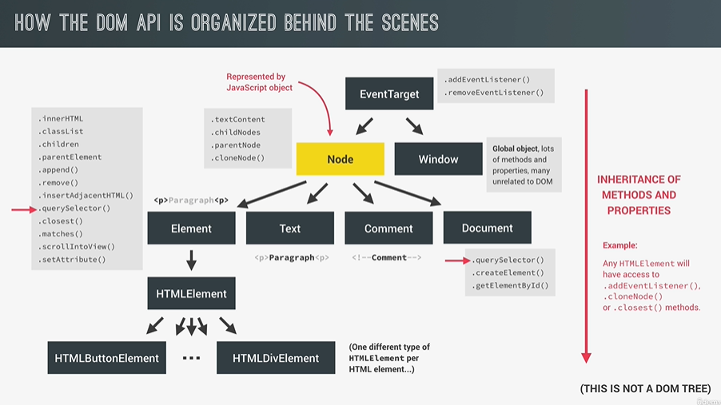
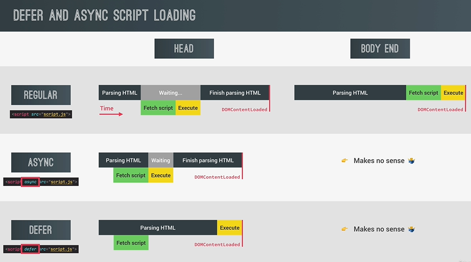

### What did I learn while coding this project ?

> #
>
> - _**What is the DOM?** DOM is basically the interface between all Javascript code and the browser. DOM is HTML documents are rendered in and by browser.,_
> - _DOM allows us to make Javascript interact with the browser. We can write Javascript to create, modify and delete HTML elements, set styles, classes and attributes and listen, respond to events.,_
> - _DOM three is genereted from an HTML document, which can interact with. DOM is a very complex API that contains lots of methods and properties to interact with the DOM tree ,_
> - _**What is a DOM tree?** DOM tree like structure made out of nodes. In the DOM there are different types of nodes. ,_
> - _**How the DOM API is organized behind the scenes ?** Each node is represented in Javascript by an object. This object gets access to special node methods and properties, such as text content, child nodes, parent nodes and many others ,_
> - _Node type has a couple of child types. These are the element type, the text type, the comment type and also the document type. The Element type has internally an HTML element and that element type itself has exactly one child type that exists in HTML. Like buttons, links, img etc. ,_
> - _There is a special node type called EventTarget which is a parent of both the node type and window node type has addEventListener() method and all nodes type inherits this method ,_
>
>     
>   
>
>    
>
> - _while querSelectorAll() method returns NodeList, getElementByTagName() and getElementsByClassName() return an HTMLCollection. HTMLCollection is updated automatically.NodeList doesn't update itself automatically ,_
> - _We use textContent and innerHTML to get and set HTML elements properties.,_
> - _insertAdjacentElement(), prepend() and append() methods to insert a DOM element to HTML ,_
> - _before() and after() methods in HTML,_
> - _remove() and removeChild() methods in Javascript ,_
> - _With style property we can set the value of property as inline css and we can get the value of property if it is declared as inline css rule ,_
> - _document.documentElement.style.setProperty('a','#345654') ,_
> - _getBoundingClientRect() is basically relative with visible view port,_
> - _window.scrollTo() and htmlElement.scrollIntoView({behavior:'smooth'}) ,_
> - _addEventListener and removeEventListener() ,_
> - _When we trigger an event then this event goes down through the target element just passes its parents element. It is named as capturing phase and when it arrived the target element then event goes up and this is names as bubling phase . In bubling phase parent elements can handle this event too, Actually when parent element catches event can be changed by giving a boolean third argument to event handler functions.Also e.target point to click elemnent e.currentElement points to this keyword - element was attached to event handler- ,_
> - _DOM Traversing with children, childNodes, firstElementChild, lastElementChild, parentElement, parentNode, previousElementSibling, nextElementSibling properties and closest() method._
> - _The Intersection Observer API ,_
> - _How to implement lazy Loading strategy with The Intersection API in Javascript ,_
> - _DOM content loaded event is fired by the document as soon as the HTML is completely parsed. This means HTML has been downloaded and been converted to the DOM tree. Also all scripts must be downloaded and executed before the DOM content loaded event can happen. This event does not wait for images and other external resources to load, just HTML and Javascript need to be loaded. We put the script tag at the end of the body to be sure about HTML has been parsed. We can access this event by document.addEventListener('DOMContentLoaded', function(){} ) ,_
> - _When all the images and external resources like CSS has finished loading is load event gets fired. This event happens on window ,_
> - _beforeunload event gets fired on window. This event is created immediately before a user is about to leave a page.Some browsers require to implement e.preventDefault() for working accurately. ,_
> - _We can write the script tag in the document head or at the end of the body. When we include a script without any attribute in the head first HTML code start to be parsed by the browser. Parsing HTML is basically building the DOM tree from the HTML elements. While parsing the HTML, it will find the script tag and start to fetch the script and then execute it. During this time HTML parsing will stop and after the script get executed the rest of the HTML can be parsed. And at the and of the parsing DOM content loaded event will finally get fired. When we define script tag at the end of the body, All HTML is parsed when it reaches the script tag. Then the script is fetched and then the script gets executed. ,_
> - _When we use async attribute during the script loading in the head of the document, the script is fetched at the same time as the HTML is parsed. However, the HTML parsing still stops for the scripts execution. The script is downloaded asynchronously but then is executed right away in a synchronous way. So the HTML code has to wait for being parsed ,_
> - _When we use the defer attribute during the script loading in the head, the script is loaded asynchronously but the execution of the script is deferred until the end of the HTML parsing. HTML parsing is never interrupted because the script is only executed at the end. ,_
> - _When we defined the script tag at the end of the body scripts are fetched and executed after the HTML is completely parsed. This approach is used if you need to support old browsers,_
> - _When we define the script tag with async attribute in the head of html, scripts are fetched asynchronously and executed immediately. Usually the DOMContentLoaded event waits for all scripts to execute, except for async scripts. So DOMContentLoaded does not wait for an async script. Scripts not guaranteed to execute in order so it uses for 3rd-party scripts where order doen't matter. ,_
> - _When we define the script tag with defer attribute, scripts are fetched asynchronously and executed after the HTML is completely parsed. DOMContentLoaded event fires after defer script is executed. Scripts are executed in order. This is the best solution when order matters! ,_
>
>  
>    
>  
>
> #
